# 金魚都能懂課程實作紀錄

- [金魚都能懂課程實作紀錄](#金魚都能懂課程實作紀錄)
  - [課程內容](#課程內容)
    - [1. float](#1-float)
    - [2. block \& inline](#2-block--inline)
      - [block \& inline介紹](#block--inline介紹)
        - [inline介紹](#inline介紹)
        - [block介紹](#block介紹)
      - [課堂小問題](#課堂小問題)
    - [3. box-sizing](#3-box-sizing)
    - [4. flex](#4-flex)
    - [5.fixed](#5fixed)
      - [5.1. 蓋板廣告](#51-蓋板廣告)
      - [5.2. 上方nav](#52-上方nav)
    - [6.Relative](#6relative)
      - [lab6 demo1](#lab6-demo1)
    - [7. Absolute](#7-absolute)
      - [lab7 demo1-基本練習](#lab7-demo1-基本練習)
      - [lab7 demo2](#lab7-demo2)
    - [Lab8-稀飯版](#lab8-稀飯版)
  - [](#)
    - [Lab9-Transition.html](#lab9-transitionhtml)


---

## 課程內容

### 1. float

- Demo畫面
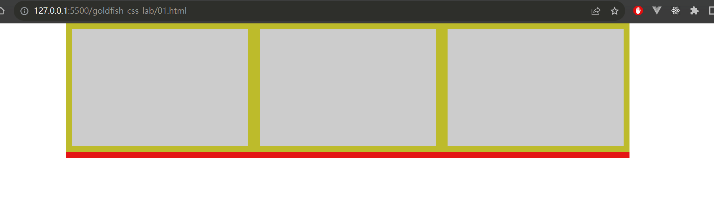

- 練習頁面
[lab1-float.html](./html/lab1-float.html)

- [float介紹]()

---

### 2. block & inline

- Demo畫面
  - demo1: inline & block基本介紹
    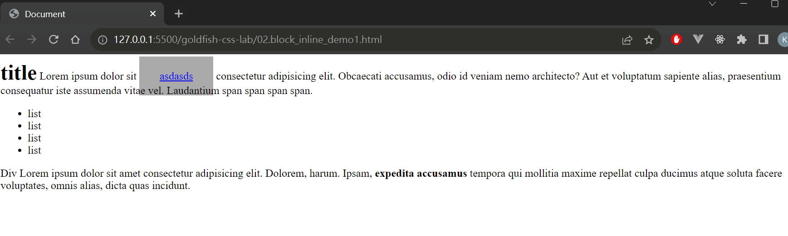
  - demo2: 實戰演練
    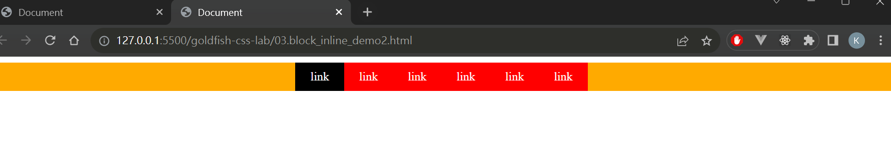


#### block & inline介紹

##### inline介紹

- 特性:
    - 不換行：inline 元素不會強制換行，它們會在同一行上盡可能佔用空間。
    - 不支持寬度和高度：inline 元素的寬度和高度由其內容決定，你無法直接設置。
    - 支持文本和內聯元素：inline 元素通常用於包裹文本和其他內聯元素，如 ```<span>```、```<a>```、```<em>``` 等。

##### block介紹

- 特性:
    - 佔據一整行：block 元素會佔據其父元素的整個寬度，即使它的內容不佔滿該行。
    - 獨立行：相鄰的 block 元素會出現在不同的行上，因此每個 block 元素都獨立於其他元素。
    - 支持寬度和高度：你可以設置 block 元素的寬度和高度，並且它會自動佔據指定的空間。


#### 課堂小問題

1. html中的ul是block 還是block?

在 HTML 中，```<ul>``` 元素（無序列表）的預設顯示屬性是 block。這意味著 ```<ul>``` 元素會佔據一整行的寬度，並將其後的元素推到下一行。

2. html中的li是block還是block?

在 HTML 中，```<li>``` 元素（列表項目）的預設顯示屬性也是 block。每個 ```<li>``` 元素都會佔據一整行的寬度，並在 ```<ul>``` 或 ```<ol>``` 元素中形成不同的列表項。

---

### 3. box-sizing

- Demo畫面
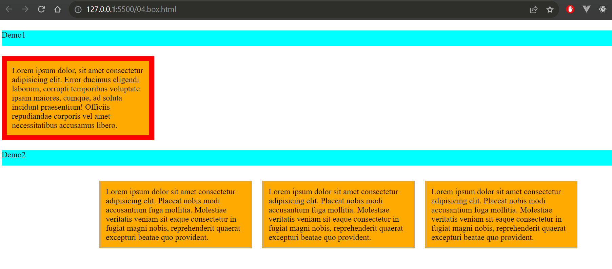

- 課程知識整理
  - box-sizing
    - border-box
    - content-box

---

### 4. flex

- Demo畫面

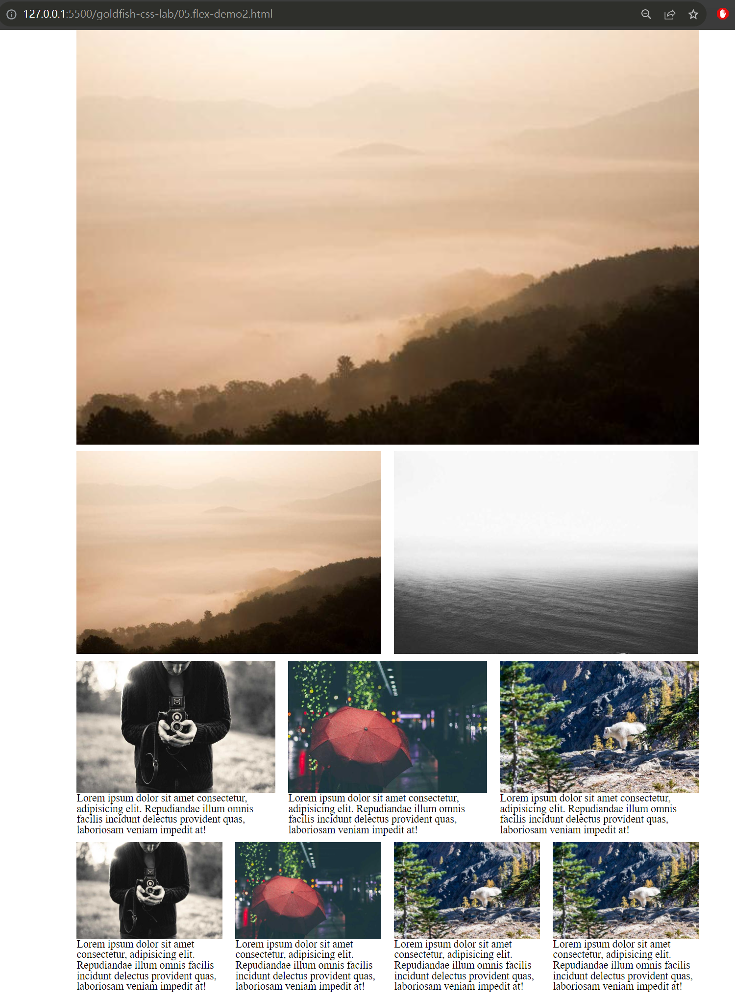

---

### 5.fixed

#### 5.1. 蓋板廣告

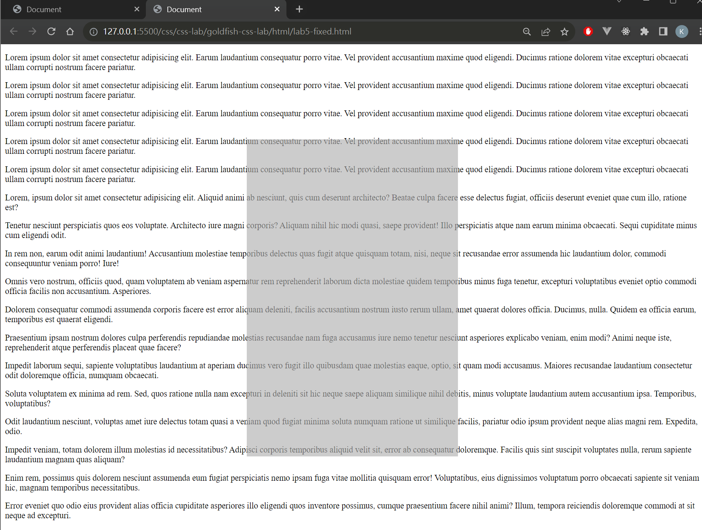

#### 5.2. 上方nav

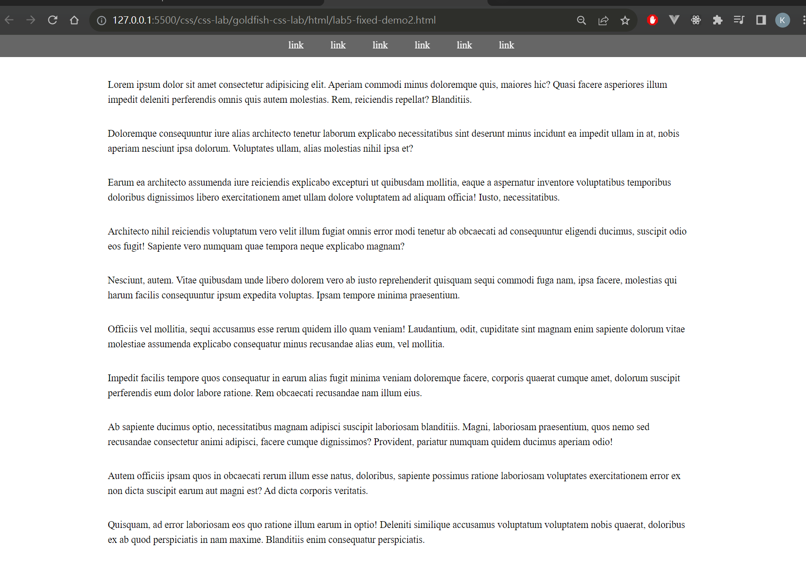

### 6.Relative

#### lab6 demo1

- 檔案位置: [lab6-relative_demo1](./html/lab6-relative_demo1.html)

- Demo

  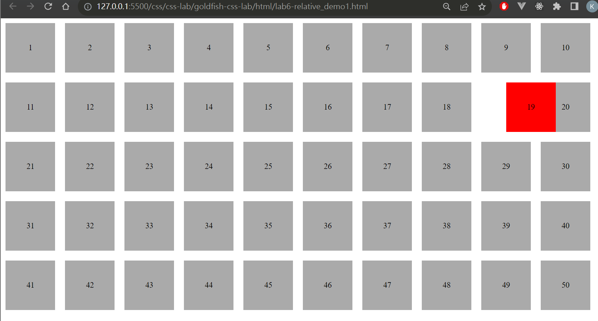

---

### 7. Absolute

#### lab7 demo1-基本練習

- 檔案位置: [lab7-Absolute](./html/lab7-absolute.demo.html)

- 重點
  - absolute只定位一次
  - absolute會往父層級找有沒有定位，如果有以下定位就會定在他們身上
    - 父層級有哪些定位:fixed、relective、absolute
  - 

- Demo
  - Step1:
    - code:

    ```css
      <style type="text/css">
      div {
        padding: 40px;
        border: 6px solid #f00;
        font-size: 24px;
      }

      .c{
        position: absolute;
      }
    </style>
    ```

    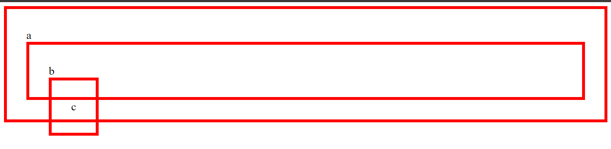

  - Step2:
    - code:

    ```css
    <style type="text/css">
      div {
        padding: 40px;
        border: 6px solid #f00;
        font-size: 24px;
      }

      .b {
        position: relative;
      }

      .c {
        position: absolute;
        right: 0;
        top: 0;
        border-color: #00f;
        padding: 20px;
      }
    </style>
    ```


    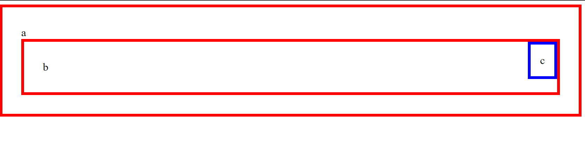


  - Step3:
    - code:

    ```css
    <style type="text/css">
      div {
        padding: 40px;
        border: 6px solid #f00;
        font-size: 24px;
      }

      body {
        position: relative;
      }

      .a {
        /* position: relative; */
      }

      .b {
        /* position: relative; */
      }

      .c {
        position: absolute;
        left: 0;
        bottom: 0;
        border-color: #00f;
        padding: 20px;
      }
    </style>
    ```
    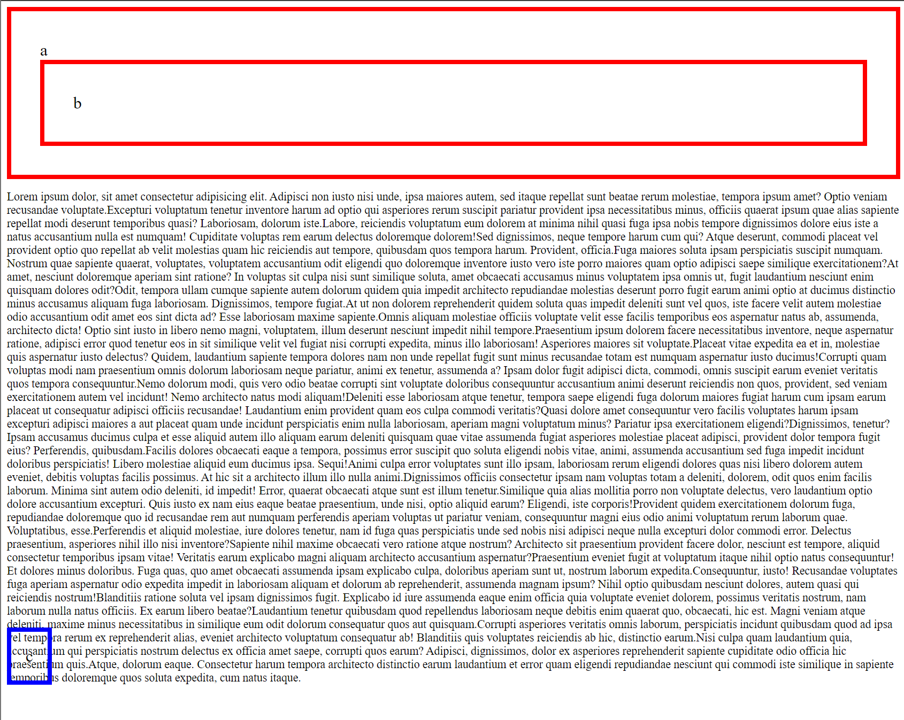


---

#### lab7 demo2

- 檔案位置: [lab7-Absolute demo2](./html/lab7-absolute-demo2.html)

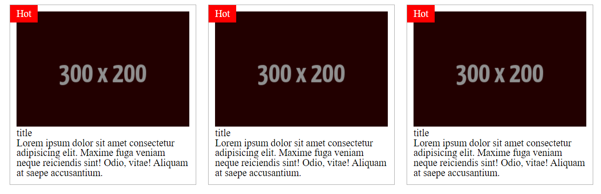

---

### Lab8-稀飯版


- 檔案位置: [lab8-排版](./html/lab8-%E6%8E%92%E7%89%88.html)

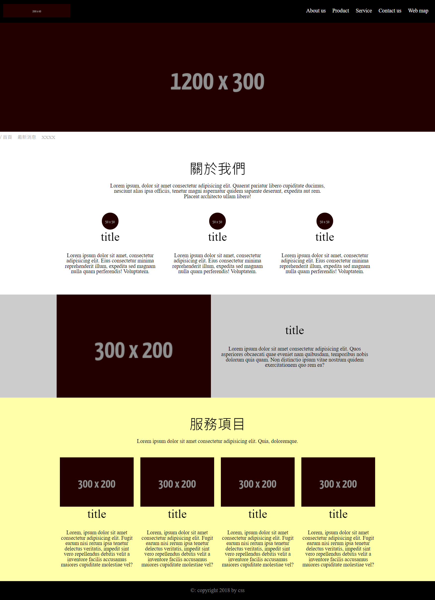
---

### Lab9-Transition.html


- 檔案位置: [lab9-Transition](./html/lab9-Transition.html)

